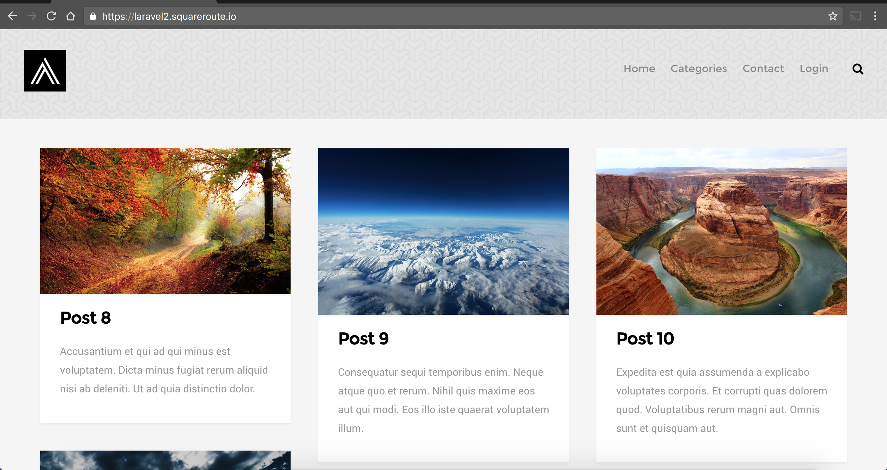

## Laravel 5-5 example ##

**Laravel 5-5 example** is a tutorial application showing how to run and maintain laravel on kubernetes. It will allow you to quickly get a database and SSL-enabled wepage working within 10 minutes which can then be tailored to your requirements.

Suggested improvements are welcome as are PRs. There isn't much available online for laravel + kubernetes together, however this presentation is probably the best material <https://www.slideshare.net/WilliamStewart20/kubernetes-laravel-and-kubernetes> and the following tutorial from Bitnami is useful also <https://docs.bitnami.com/kubernetes/how-to/deploy-php-application-kubernetes-helm/>.

## Prerequisities ##
This tutorial assumes you have access to a cloud-based cluster with kubernetes v1.9 or higher (e.g. GKE, ACS-engine or AWS - Google Kubernetes Engine's free trial is the easiest to setup and a 3*N1-Standard-1 is sufficient). A domain URL and ability to change DNS A records is also assumed. Nginx-ingress for tls termination is used.
Helm (`brew install kubernetes-helm` >v2.8.2) and kubectl (`brew install kubectl` >1.9.3) are assumed to be installed and pointing at your cluster. A common pitfall for new users to helm is Role-Based-Access-Control, so if you're new to helm, you should give helm the required access with `kubectl apply -f kubernetes/kubernetes-yaml/rbac-tiller.yaml` and then use `helm init --service-account tiller`.

## Installation ##

```bash
git clone https://github.com/EamonKeane/larvel5-5-example
```

```bash
cd laravel5-5-example
```

* check that  helm and kubectl are on the right versions on the server and locally

```bash
helm version
Client: &version.Version{SemVer:"v2.8.2", GitCommit:"a80231648a1473929271764b920a8e346f6de844", GitTreeState:"clean"}
Server: &version.Version{SemVer:"v2.8.2", GitCommit:"a80231648a1473929271764b920a8e346f6de844", GitTreeState:"clean"}
```

```bash
kubectl version
Client Version: version.Info{Major:"1", Minor:"9", GitVersion:"v1.9.3", GitCommit:"d2835416544f298c919e2ead3be3d0864b52323b", GitTreeState:"clean", BuildDate:"2018-02-09T21:51:54Z", GoVersion:"go1.9.4", Compiler:"gc", Platform:"darwin/amd64"}
Server Version: version.Info{Major:"1", Minor:"9+", GitVersion:"v1.9.4-gke.1", GitCommit:"10e47a740d0036a4964280bd663c8500da58e3aa", GitTreeState:"clean", BuildDate:"2018-03-13T18:00:36Z", GoVersion:"go1.9.3b4", Compiler:"gc", Platform:"linux/amd64"}
```

* Specify your domain:

```bash
MY_URL=laravel2.squareroute.io # change this to your domain
```

* If you don't already have nginx-ingress installed on your cluster, install it:

```bash
helm install stable/nginx-ingress --name nginx-ingress --namespace laravel5
```

* Add your nginx-ingress IP address as a DNS A record pointing to your laravel URL:

```bash
INGRESS_IP=$(kubectl get svc --namespace laravel5 -o json | jq .items[0].status.loadBalancer.ingress[0].ip)
```

* Verify that it has updated

```bash
dig $MY_URL
...
;; ANSWER SECTION:
laravel2.squareroute.io. 5      IN      A       35.230.155.177
...
```

Install Cert-Manager for automatic SSL provisioning. <https://github.com/kubernetes/charts/tree/master/stable/cert-manager>

```bash
helm install stable/cert-manager --name cert-manager --namespace laravel5 --set ingressShim.extraArgs='{--default-issuer-name=letsencrypt-prod,--default-issuer-kind=ClusterIssuer}','extraArgs={--v=4}'
```

```bash
kubectl apply -f kubernetes/helm/cert-manager/acme-prod-cluster-issuer.yaml
```

* Install the mysql database with preconfigured password:

```bash
helm install stable/mysql --wait --timeout 400 --name mysql --namespace laravel5 --set mysqlRootPassword=imApMsfoDt,mysqlDatabase=homestead
```

* Make repository for the nginx and phpfpm dockerfiles (skip to the `Replace URL` section to use the images already built):

```bash
MY_PHP_REPO=quay.io/eamonkeane/laravel
MY_NGINX_REPO=quay.io/eamonkeane/laravel-nginx
```

* Build and push the docker images. This tutorial assumes the respositories are publicly accessible.

```bash
docker build . -t ${MY_PHP_REPO}:latest -f docker/php-fpm/Dockerfile; docker push {MY_PHP_REPO}:latest
```

```bash
docker build . -t ${MY_NGINX_REPO}:latest -f docker/nginx/Dockerfile; docker push {MY_NGINX_REPO}:latest
```

* Replace the images in the helm chart with the ones you have built:

```bash
sed -i '' -e "s#quay.io/eamonkeane/laravel#${MY_PHP_REPO}#g" kubernetes/helm/laravel5/values.yaml
```

```bash
sed -i '' -e "s#quay.io/eamonkeane/laravel#${MY_NGINX_REPO}#g" kubernetes/helm/laravel5/values.yaml
```

* Replace the URL in the .env with your url. Note the .env is kept in the helm folder for convenience to make the secret as part of this tutorial. If using this for production, make the secrets separately using `kubectl create secret generic ${SECRET_NAME} --from-file=${SECRET_FILE}` or use a tool to encrypt the secrets such as helm secrets: <https://github.com/futuresimple/helm-secrets>.

```bash
sed -i '' -e "s#https://laravel2.squareroute.io#https://${MY_URL}#g" kubernetes/helm/laravel5/laravel5-env.env
```

* Install laravel5. This will seed the mysql database before creating the php containers using a pre-install job.

```bash
helm upgrade --install --wait --timeout 400 --namespace laravel5 laravel5 kubernetes/helm/laravel5
```

* After approximately 2 minutes the website will be visible at `https://${MY_URL}`



For changes to the repository, the same command can be run again. This time it will not perform a database seed, but will only perform the migrations before installing the new pods.

```bash
helm upgrade --install --wait --timeout 400 --namespace laravel5 laravel5 kubernetes/helm/laravel5
```

## Cleaning Up ##

This will delete everything created by the above tutorial but leave everything else in your cluster as it was.

```bash
`kubectl delete namespace laravel5`
```

The helm chart contains the following features which are relevant to laravel:

* Logs are tailed to standard out from the `/storage/logs/laravel.log` in keeping with Kubernetes best practice

* PHP-FPM is PID 1 in the php container

* Migrations and seeding are performed as pre-install jobs and upgrades. It is possible to manage these outside of the helm chart (for example as part of a CI/CD workflow, to run a job before running `helm upgrade`). See the discussion here <https://github.com/kubernetes/helm/issues/2243> and here <https://blog.bigbinary.com/2017/06/16/managing-rails-tasks-such-as-db-migrate-and-db-seed-on-kuberenetes-while-performing-rolling-deployments.html>

* Configuration files (nginx.conf and laravel-site.conf) are kept in the helm folder (helm can't access files outside this folder) and the configmap is updated each time the deployment is triggered.

* Configmap changes to nginx trigger an upgrade of the nginx deployment

* Nginx and PHP as separate deployments to allow for independetly scaling the number of replicas. It is also possible to have these as multiple containers in the same pod.

As mentioned, improvements are welcome.